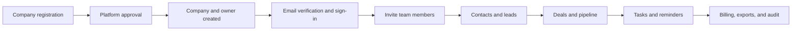

# CoreFlow CRM system architecture

## Request path

1. A platform administrator, company administrator, manager, or staff member connects over HTTPS to the Render web service.
2. Apache forwards the request to Laravel. Authentication, active-account, email-verification, role, subscription, and throttling middleware run before protected controllers.
3. Tenant-aware controllers and models scope company-owned records with the authenticated user's `company_id`.
4. CRM, onboarding, billing, workspace, and optional AI modules read and write a shared Neon PostgreSQL schema. Sessions, cache entries, and queued jobs also use PostgreSQL.
5. The scheduler finds due follow-ups hourly and dispatches `SendTaskReminder` jobs. The queue worker processes those jobs with retries and backoff.
6. Email supports account verification, invitations, password reset, and reminders. The optional AI integration requires company consent, usage quotas, and human review.

## Main business flow

## Tenant boundary

CoreFlow uses shared-database multi-tenancy. Company-owned rows carry a `company_id`, and authenticated workspace operations must resolve records inside that company scope. Roles decide what a user may do inside the tenant; the tenant scope decides which records the user may reach.
