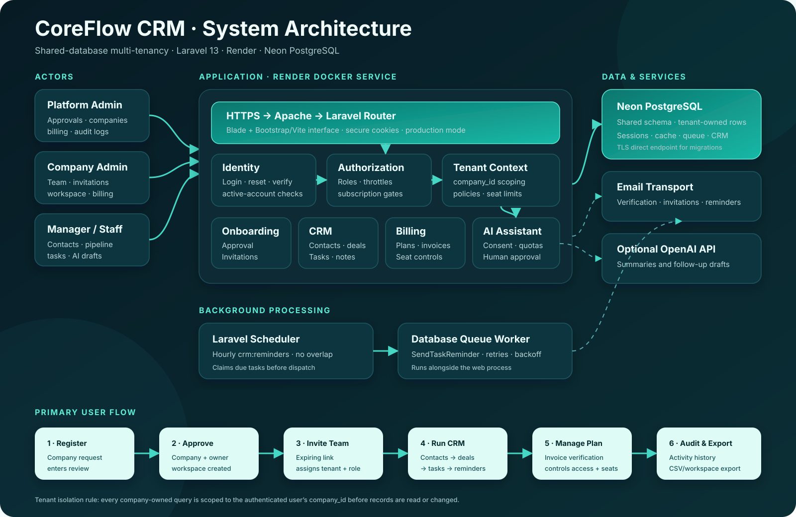

# CoreFlow CRM user guide

CoreFlow is a multi-tenant customer relationship management workspace. Each company has a private workspace for its users, contacts, opportunities, tasks, billing records, and activity history. A clean installation contains no company or CRM records until an administrator approves a registration or creates them.

## Open CoreFlow

- Application: [https://coreflow-crm-demo.onrender.com](https://coreflow-crm-demo.onrender.com)
- Platform administrators use credentials configured privately by the system owner.
- Company users receive access through approved registration and invitation workflows.

The free Render service sleeps while inactive. The first page can take about a minute to open; refresh once after the service finishes waking.

## Sign in

1. Open the application and select **Sign in**.
2. Enter your email address and password.
3. Select **Keep me signed in** only on a private device.
4. Select **Sign in**.

Your account must be active and your email must be verified before protected workspace pages become available. Use **Forgot password?** on the sign-in page if you cannot access your account.

## Understand the roles

### Platform administrator

The platform administrator operates the SaaS platform across all companies. This role can:

- Review and approve or reject registration requests.
- Manage companies, company owners, employees, and roles.
- Review invoices and confirm or reject submitted payment references.
- Inspect the platform activity log.

### Company administrator

The company administrator manages one company workspace. This role can:

- Use every CRM feature available to the company plan.
- Invite, edit, suspend, and remove team members within the company.
- View plan information, submit a payment reference, and cancel renewal.
- Edit workspace details and export workspace data.

### Manager and staff

Managers and staff work inside their assigned company. Depending on their permissions, they can:

- Manage contacts, deals, and follow-up tasks.
- View the workspace dashboard and pipeline.
- Export contacts or workspace information.
- Use AI assistance when the feature is configured and the company has granted consent.

Users cannot access records owned by another company. CoreFlow resolves company-owned records through the authenticated user's `company_id`.

## Use the workspace dashboard

After signing in, CoreFlow opens **Workspace → Overview**. The dashboard shows:

- Total contacts in the workspace.
- Open opportunities.
- Current open-pipeline value.
- Won revenue.
- Deal counts for each pipeline stage.
- Upcoming follow-up tasks.
- Recently added contacts.

Select **New opportunity** to create a deal, or use the navigation menu to open Contacts, Pipeline, Tasks, AI assistant, Plan & billing, or Workspace settings.

## Manage contacts

Open **Workspace → Contacts** to view the company contact list.

### Add a contact

1. Select **New contact**.
2. Enter the person's name and relevant contact details.
3. Add the organization, lifecycle status, notes, and assigned team member when applicable.
4. Save the contact.

### Edit or remove a contact

1. Open **Contacts**.
2. Select the contact you want to change.
3. Update the fields and save, or choose the delete action.

CoreFlow only resolves the record inside the current company workspace.

### Import contacts from CSV

1. Open **Contacts** and choose the import action.
2. Select a CSV file using the field names shown by the import screen.
3. Review the validation result.
4. Correct invalid rows and import the file again if needed.

Review imported information before saving it and follow your organization's data-handling policy.

### Export contacts

Select **Export** on the Contacts page to download the current company's contact data as CSV.

## Manage the opportunity pipeline

Open **Workspace → Pipeline** to view deals by stage.

### Create an opportunity

1. Select **New opportunity**.
2. Choose the related contact.
3. Enter a title, value, currency, expected close date, stage, owner, and notes.
4. Save the opportunity.

### Update an opportunity

Open a deal and move it through the available stages:

1. **New** — the opportunity was identified.
2. **Qualified** — the need and fit were confirmed.
3. **Proposal** — an offer or proposal was provided.
4. **Won** — the deal was completed successfully.
5. **Lost** — the opportunity closed without a sale.

Keep the deal value and stage current so dashboard totals remain useful.

## Manage follow-up tasks

Open **Workspace → Tasks** to coordinate follow-ups.

1. Create a task and relate it to a contact or opportunity when appropriate.
2. Assign the task to a workspace member.
3. Set a due date and keep its status current.
4. Mark the task complete after the follow-up is finished.

The scheduler checks due tasks hourly. Eligible reminders are placed on the database queue and processed by the queue worker with retries and backoff.

## Use the AI assistant

Open **Workspace → AI assistant**. The feature is available only when:

- The platform has configured and enabled the AI provider.
- The company has granted AI consent.
- The tenant has remaining usage quota.

CoreFlow can prepare activity summaries and follow-up drafts. Review and edit every generated result before using it. AI output is a draft and is never sent to a customer automatically.

The current deployment keeps external AI disabled until an API provider is configured.

## Manage team members

Company administrators can open **People → Team members**.

### Invite a team member

1. Open **People → Invitations**.
2. Enter the employee's email address and select the appropriate role.
3. Send the invitation.
4. The employee opens the expiring, single-use link and creates a password.

The invitation assigns the employee to the current company. Seat limits are checked before a member is added.

### Change a team member

1. Open **Team members**.
2. Select the employee.
3. Update the permitted fields or role.
4. Save the changes.

Suspend an account to block access without immediately deleting its record. Revoke an unused invitation from the Invitations screen when it should no longer be accepted.

## Manage the plan and billing

Open **Workspace → Plan & billing** to see the current plan, subscription status, seat allowance, and invoices.

The current version uses a manual invoice workflow:

1. Review the invoice and payment instructions.
2. Make the transfer outside CoreFlow when operating a real private deployment.
3. Submit the transfer reference against the correct invoice.
4. A platform administrator verifies or rejects the submission.
5. A verified current invoice activates the associated plan and access period.

CoreFlow does not store cards or perform automatic charging in the manual invoice workflow.

Select **Cancel renewal** when the company should retain access through the paid period but not renew afterward.

## Update workspace settings

Open **Workspace → Workspace settings** to manage company information available to your role.

Company administrators can also use the workspace export action to download company CRM information. Store exported files securely because they can contain customer and employee information.

## Platform administration workflow

### Approve a registration

1. Sign in with a platform administrator account.
2. Open **Registrations**.
3. Review the submitted company and owner information.
4. Approve the request to create the company and owner account, or reject it with the appropriate internal decision.
5. The owner completes email verification and signs in.

### Manage companies and owners

Use **Companies** and **Owners** to inspect or update platform records. Company deletion is reversible: archived companies can be restored by the platform administrator.

### Review a payment

1. Open the administrative billing screen.
2. Select the pending invoice submission.
3. Compare the reference with the external payment record.
4. Mark the invoice paid only after verification, or reject the submission.

### Review activity

Open **Activity logs** to investigate important administrative and workspace actions. Use the record timestamp, actor, action, and affected resource to understand what changed.

## Registration and onboarding flow

1. A prospective company submits the public registration form.
2. A platform administrator reviews the request.
3. Approval creates the company workspace and owner account.
4. The owner verifies their email and signs in.
5. The owner configures the workspace and invites employees.
6. Employees accept expiring invitations and create their own passwords.
7. The team adds contacts, moves opportunities through the pipeline, and completes follow-up tasks.

## Security guidance

- Use a unique password and keep it private.
- Do not share an authenticated browser session.
- Sign out on shared devices.
- Assign the least-powerful role needed for each employee.
- Suspend former employees promptly and revoke unused invitations.
- Confirm that exports are stored in an approved location.
- Only enter customer data that your organization is authorized to process.
- Contact the platform administrator if a record appears in the wrong workspace.

## Troubleshooting

### The application is slow to open

The free Render service may be waking from sleep. Wait about a minute and refresh the page.

### Sign-in is rejected

- Confirm the email and password.
- Check whether the account is active.
- Complete email verification if requested.
- Use **Forgot password?** to request a reset link when email delivery is configured.

### A CRM page is unavailable

The company may not have an active trial or paid access period. Open **Plan & billing** or contact the company administrator.

### An action is missing

The current role may not have permission. Ask a company administrator or platform administrator to review the account role.

### An invitation cannot be accepted

The invitation may be expired, revoked, already used, or blocked by the plan's seat limit. Ask the company administrator to send a new invitation after confirming an available seat.

## Architecture reference

See [SYSTEM_ARCHITECTURE.md](SYSTEM_ARCHITECTURE.md) for the request path, tenant boundary, infrastructure components, and business-flow diagram.
